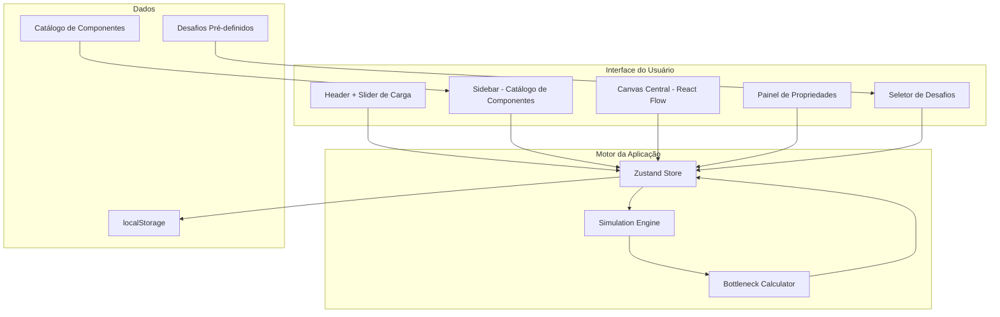

# Design Spec: System Design Playground

- **Autor**: Agente de IA / Guilherme Altmann
- **Data**: 2026-07-16
- **Status**: Em Revisão

---

## 1. Contexto e Motivação

Arquitetos de software frequentemente precisam validar ideias de arquitetura antes de implementá-las. Hoje, isso é feito em whiteboards, draw.io ou documentos estáticos — nenhuma dessas ferramentas fornece **feedback em tempo real** sobre gargalos e capacidade.

O **System Design Playground** é uma ferramenta web interativa onde o usuário monta arquiteturas arrastando componentes em um canvas, configura suas propriedades e **simula o comportamento** sob diferentes cargas de tráfego. As conexões entre componentes mudam de cor (verde → vermelho) em tempo real conforme gargalos são detectados.

---

## 2. Requisitos de Negócio e Sucesso

### Funcionalidades Core (Fase 1)

| # | Requisito | Critério de Sucesso |
|---|-----------|-------------------|
| 1 | **Canvas interativo** | Drag & drop de componentes, conexões visuais, zoom, pan |
| 2 | **Catálogo de componentes** | 6 categorias com ~15 componentes, cada um com ícone e propriedades editáveis |
| 3 | **Propriedades por componente** | Painel lateral com campos específicos (ex: sharding no DB) |
| 4 | **Motor de simulação** | Recalcula gargalos em tempo real baseado em req/s e capacidade dos componentes |
| 5 | **Visualização de gargalos** | Conexões com cores (verde/amarelo/vermelho) e animação de fluxo |
| 6 | **Slider de carga** | Input global de "requisições por segundo" que alimenta a simulação |
| 7 | **Desafios pré-definidos** | Tela de seleção de desafios com descrição de requisitos (ex: "Projete o Twitter") |
| 8 | **Modo sandbox** | Canvas livre sem restrições de desafio |
| 9 | **Persistência local** | Salvar/carregar cenários no localStorage |
| 10 | **Design premium** | Dark mode, glassmorphism, micro-animações, tipografia moderna |

### Fora de Escopo (Fase 2+)

- Export/Import JSON
- Backend e autenticação
- Solução de referência nos desafios
- Dashboard de métricas avançado
- Componentes adicionais e propriedades detalhadas

---

## 3. Abordagem Proposta e Arquitetura

### 3.1 Stack Tecnológico

| Camada | Tecnologia | Justificativa |
|--------|-----------|---------------|
| **Framework** | React 19 + TypeScript | Ecossistema maduro, forte com componentes visuais |
| **Bundler** | Vite | Build rápido, HMR instantâneo |
| **Canvas/Grafos** | React Flow v12 | Lib feita para editores de nodes/edges, com drag & drop, zoom, minimap nativos |
| **Animações** | Framer Motion | Animações fluidas para UI + transições |
| **Estado** | Zustand | Leve, sem boilerplate, recomendado pelo React Flow |
| **Estilo** | Vanilla CSS (CSS Modules) | Controle total, sem dependência extra |
| **Fonte** | Inter (Google Fonts) | Tipografia moderna e legível |

### 3.2 Arquitetura de Alto Nível



### 3.3 Motor de Simulação

O motor de simulação é o coração da aplicação. Ele funciona assim:

#### Fluxo de Cálculo

```
1. Usuário ajusta slider → dispara recálculo
2. Engine identifica nós de entrada (Clients/Users)
3. Propaga carga pelo grafo seguindo as conexões (BFS)
4. Em cada nó:
   a. Calcula carga efetiva (aplicando cache hit ratio, read/write split, etc.)
   b. Verifica limites de recursos (connection pool, threads, memória)
   c. Calcula ratio = carga_efetiva / capacidade_efetiva
   d. Calcula latência acumulada (processing + network)
5. Classifica cada conexão:
   - ratio < 0.6  → 🟢 Verde (saudável)
   - ratio 0.6~0.85 → 🟡 Amarelo (atenção)
   - ratio > 0.85 → 🔴 Vermelho (gargalo)
   - ratio > 1.0  → 🔴💀 Vermelho pulsante (saturado — requests sendo dropados)
6. Detecta cascading failures (se nó satura, backpressure propaga upstream)
7. Atualiza visual das edges com cores, velocidade de animação e latência
```

---

### 3.4 Especificações Realistas dos Componentes

Os valores abaixo são baseados em **benchmarks reais de produção** para que a simulação reflita cenários do mundo real. O usuário pode customizar todos os valores.

#### 🌐 Camada de Rede

##### Load Balancer (NGINX / HAProxy)

| Propriedade | Valor Padrão | Tipo | Afeta Capacidade |
|-------------|-------------|------|------------------|
| Tipo | `nginx` | select: nginx, haproxy, aws-alb | ✅ |
| Algoritmo | `round-robin` | select: round-robin, least-connections, ip-hash, weighted | ❌ |
| Max Conexões Simultâneas | 50.000 | number | ✅ |
| Workers/Threads | 4 | number (1-64) | ✅ |
| Health Check Interval | 5s | number | ❌ |
| SSL Termination | true | boolean | ✅ (overhead ~10-20%) |
| Keep-Alive | true | boolean | ❌ |

**Capacidade base por tipo:**
- **NGINX**: ~25.000 req/s por worker (L7), ~100.000 req/s por worker (L4)
- **HAProxy**: ~40.000 req/s por thread
- **AWS ALB**: ~100.000 novas conexões/s (não configurável, escala automático)

**Cálculo de capacidade**: `workers × throughput_por_worker × (ssl ? 0.82 : 1.0)`

**Latência adicionada**: 0.5ms (L4) ou 1-2ms (L7 com SSL)

##### API Gateway (Kong / AWS API Gateway)

| Propriedade | Valor Padrão | Tipo | Afeta Capacidade |
|-------------|-------------|------|------------------|
| Tipo | `kong` | select: kong, aws-apigw, custom | ✅ |
| Rate Limiting | 10.000 req/s | number | ✅ (hard cap) |
| Autenticação | `jwt` | select: none, api-key, jwt, oauth2 | ✅ |
| Plugins ativos | 2 | number (0-10) | ✅ |
| Request Validation | false | boolean | ✅ |
| Timeout | 29s | number | ❌ |

**Capacidade por tipo:**
- **Kong**: ~15.000 req/s base, -8% por plugin ativo
- **AWS API Gateway**: 10.000 req/s (soft limit padrão, ajustável)

**Overhead de autenticação**: none=0ms, api-key=0.5ms, jwt=2ms, oauth2=5ms

**Cálculo**: `min(rate_limit, base × (1 - 0.08 × plugins) × auth_factor)`

##### CDN (CloudFront / Cloudflare)

| Propriedade | Valor Padrão | Tipo | Afeta Capacidade |
|-------------|-------------|------|------------------|
| Cache Hit Ratio | 85% | number (0-99) | ✅ |
| Cache TTL | 3600s | number | ❌ |
| Regiões (PoPs) | 3 | number (1-50) | ✅ |
| Edge Computing | false | boolean | ✅ |
| Compressão (Brotli) | true | boolean | ❌ |

**Capacidade**: Virtualmente ilimitada (~1M+ req/s em escala global)

**Impacto real**: O CDN reduz a carga no origin server. A carga propagada ao backend é: `incoming × (1 - cache_hit_ratio/100)`. Isso é **crítico** para a simulação — um CDN com 95% de hit ratio reduz 20x a carga no backend.

**Latência**: Edge=5-20ms, Origin miss=50-200ms

##### DNS

| Propriedade | Valor Padrão | Tipo | Afeta Capacidade |
|-------------|-------------|------|------------------|
| TTL | 300s | number | ❌ |
| Tipo | `route53` | select: route53, cloudflare, custom | ❌ |
| Routing Policy | `simple` | select: simple, weighted, latency-based, geolocation, failover | ❌ |

**Capacidade**: Passthrough (não é gargalo em cenários normais)
**Latência**: 1-50ms (depende de cache do resolver)

---

#### ⚙️ Camada de Computação

##### Web Server (Node.js / Go / Java)

| Propriedade | Valor Padrão | Tipo | Afeta Capacidade |
|-------------|-------------|------|------------------|
| Runtime | `nodejs` | select: nodejs, go, java-spring, python-django, dotnet | ✅ |
| Instâncias | 2 | number (1-100) | ✅ |
| CPU Cores por Instância | 4 | number (1-64) | ✅ |
| Memória (GB) | 8 | number (0.5-256) | ✅ |
| Max Concurrent Requests | 1000 | number | ✅ (hard cap) |
| Connection Pool (DB) | 20 | number (5-200) | ✅ |
| Auto-Scaling | false | boolean | ✅ |
| Min Instances (auto-scale) | 2 | number | ✅ |
| Max Instances (auto-scale) | 10 | number | ✅ |
| Scale-up Threshold | 70% | number (50-95) | ❌ |

**Throughput por runtime (por core):**
- **Node.js**: ~2.500 req/s (single-threaded por processo, cluster mode)
- **Go**: ~12.000 req/s (goroutines, alta concorrência nativa)
- **Java/Spring**: ~4.000 req/s (thread pool, JVM warm)
- **Python/Django**: ~800 req/s (GIL, gunicorn workers)
- **.NET**: ~8.000 req/s (Kestrel, async/await)

**Cálculo**: `instâncias × cores × throughput_por_core × memory_factor`

**Memory factor**: Se `memória < cores × 2GB` → degradação de 30% (swap/GC pressure)

**Connection pool bottleneck**: O throughput efetivo para operações de DB é limitado por: `min(throughput, connection_pool × (1000 / avg_query_time_ms))`

##### Microservice

Mesmas propriedades do Web Server, com defaults menores:
- Instâncias: 3
- CPU Cores: 2
- Memória: 4GB
- Max Concurrent: 500

**Consideração adicional**: Cada hop entre microservices adiciona ~1-5ms de latência (serialização + rede). O simulador soma essa latência a cada edge entre serviços de computação.

##### Serverless Function (AWS Lambda / Cloud Functions)

| Propriedade | Valor Padrão | Tipo | Afeta Capacidade |
|-------------|-------------|------|------------------|
| Provedor | `aws-lambda` | select: aws-lambda, gcp-functions, azure-functions | ✅ |
| Memória (MB) | 512 | number (128-10240) | ✅ |
| Concorrência Máxima | 1000 | number (1-10000) | ✅ (hard cap) |
| Cold Start (ms) | 250 | number (50-3000) | ❌ (afeta latência) |
| Cold Start Ratio | 5% | number (1-30) | ❌ |
| Timeout | 30s | number | ❌ |
| Provisioned Concurrency | 0 | number (0-500) | ✅ |

**Throughput**: `concorrência_máxima × (1000 / avg_execution_time_ms)`

**Latência**: `processing_time + (cold_start × cold_start_ratio / 100)`

**Custo real**: Lambda cobra por invocação + duração. Não é bottleneck por req/s, mas por **concorrência**.

---

#### 🗄️ Camada de Dados

##### SQL Database (PostgreSQL / MySQL)

| Propriedade | Valor Padrão | Tipo | Afeta Capacidade | Grupo UI |
|-------------|-------------|------|------------------|----------|
| Engine | `postgresql` | select: postgresql, mysql, aurora, sql-server | ✅ | General |
| Instance Size | `db.r6g.2xlarge` | select: (ver tabela abaixo) | ✅ | Hardware |
| CPU Cores | 8 | number (2-96) | ✅ | Hardware |
| Memória (GB) | 32 | number (4-768) | ✅ | Hardware |
| Storage Type | `gp3` | select: gp2, gp3, io1, io2, local-nvme | ✅ | Hardware |
| Storage IOPS | 3.000 | number (100-256.000) | ✅ | Hardware |
| Storage Throughput (MB/s) | 125 | number (125-4.000) | ✅ | Hardware |
| Max Connections | 100 | number (20-5.000) | ✅ | Connections |
| Connection Pooler | `none` | select: none, pgbouncer, proxysql | ✅ | Connections |
| Pool Mode | `transaction` | select: session, transaction, statement | ✅ | Connections |
| Pooler Max Connections | 1.000 | number (100-10.000) | ✅ | Connections |
| Read/Write Ratio | `80/20` | select: 50/50, 70/30, 80/20, 90/10, 95/5 | ✅ | Workload |
| Query Complexity | `simple` | select: simple, moderate, complex, analytical | ✅ | Workload |
| Avg Query Time (ms) | 5 | number (0.5-1000) | ✅ | Workload |
| Sharding | false | boolean | ✅ | Scaling |
| Shard Count | 1 | number (1-64) | ✅ | Scaling |
| Read Replicas | 0 | number (0-15) | ✅ | Scaling |
| Replication Type | `async` | select: async, semi-sync, sync | ✅ | Scaling |
| Replication Lag (ms) | 10 | number (1-1000) | ❌ | Scaling |

---

**📊 Throughput Base por Engine e Tamanho de Instância (queries/s, query simples):**

| Engine | 2 cores / 8GB | 4 cores / 16GB | 8 cores / 32GB | 16 cores / 64GB | 32 cores / 128GB | 64 cores / 256GB |
|--------|:------------:|:--------------:|:--------------:|:---------------:|:----------------:|:----------------:|
| **PostgreSQL** reads | 2.500 | 4.800 | 8.000 | 14.000 | 22.000 | 32.000 |
| **PostgreSQL** writes | 600 | 1.200 | 2.000 | 3.500 | 5.500 | 8.000 |
| **MySQL (InnoDB)** reads | 3.500 | 7.000 | 12.000 | 20.000 | 32.000 | 48.000 |
| **MySQL (InnoDB)** writes | 800 | 1.600 | 3.000 | 5.000 | 8.000 | 12.000 |
| **Aurora** reads | 4.500 | 8.500 | 15.000 | 26.000 | 42.000 | 65.000 |
| **Aurora** writes | 1.000 | 2.000 | 4.000 | 7.000 | 11.000 | 16.000 |
| **SQL Server** reads | 3.000 | 5.800 | 10.000 | 17.000 | 27.000 | 40.000 |
| **SQL Server** writes | 700 | 1.400 | 2.500 | 4.200 | 6.500 | 9.500 |

> Os valores acima assumem `query_complexity = simple` e `IOPS >= 3.000`. O throughput **não escala linearmente** com cores — há rendimento decrescente acima de 32 cores (~85% de eficiência por core adicional).

**Fórmula de scaling por cores:**
```
cores_factor = (cores / 8) ^ 0.85   // Expoente < 1 = rendimento decrescente
// Exemplo: 16 cores → (16/8)^0.85 = 1.8× (não 2×)
// Exemplo: 64 cores → (64/8)^0.85 = 5.7× (não 8×)
```

---

**📊 Impacto de Cada Propriedade no Throughput:**

| Propriedade | Fator Multiplicador | Impacto em Reads | Impacto em Writes | Notas |
|-------------|-------------------|:----------------:|:-----------------:|-------|
| **Query Complexity** | | | | |
| ↳ `simple` (PK lookup, index scan) | ×1.0 | ✅ | ✅ | ~0.5-2ms por query |
| ↳ `moderate` (joins 2-3 tabelas) | ×0.4 | ✅ | ✅ | ~5-15ms por query |
| ↳ `complex` (joins 4+, subqueries) | ×0.15 | ✅ | ✅ | ~20-100ms por query |
| ↳ `analytical` (full scan, GROUP BY) | ×0.05 | ✅ | ❌ | ~200-2000ms por query |
| **Read Replicas** | ×(1 + replicas) | ✅ | ❌ | Só escala reads! Writes vão apenas ao primary |
| **Sharding** | ×shard_count | ✅ | ✅ | Escala linear para queries single-shard |
| **Replication Type** | | ❌ | ✅ | |
| ↳ `async` | ×1.0 (writes) | | ✅ | Sem overhead, risco de data loss |
| ↳ `semi-sync` | ×0.8 (writes) | | ✅ | Espera 1 réplica confirmar |
| ↳ `sync` | ×0.5 (writes) | | ✅ | Espera TODAS réplicas. Latência alta |
| **Memória** | | | | |
| ↳ `memória >= working_set` | ×1.0 | ✅ | ✅ | Tudo em RAM = ótimo |
| ↳ `memória < working_set` | ×0.3 - ×0.7 | ✅ | ✅ | Page faults, leitura de disco |
| **Storage IOPS** | | | | |
| ↳ `IOPS >= queries × 2` | ×1.0 | ✅ | ✅ | IOPS não é gargalo |
| ↳ `IOPS < queries × 2` | ×(IOPS / (queries × 2)) | ✅ | ✅ | Disk-bound, degradação severa |

---

**📊 Impacto do Storage Type:**

| Storage Type | IOPS Máx | Throughput Máx | Latência | Custo Relativo |
|-------------|---------|---------------|----------|----------------|
| `gp2` | 16.000 | 250 MB/s | ~1ms | $ |
| `gp3` | 16.000 (base 3.000) | 1.000 MB/s | ~1ms | $ |
| `io1` | 64.000 | 1.000 MB/s | ~0.5ms | $$$ |
| `io2` | 256.000 | 4.000 MB/s | ~0.3ms | $$$$ |
| `local-nvme` | 350.000+ | 7.000+ MB/s | ~0.1ms | $$$ (ephemeral) |

---

**🔑 Fórmula Completa de Capacidade SQL — Read Path:**

```
// 1. Base throughput pela engine + hardware
base_read = engine_base_reads[engine][instance_size]
           × query_complexity_factor[complexity]

// 2. Escala horizontal (read replicas)
total_read_capacity = base_read × (1 + read_replicas)

// 3. Escala via sharding (se habilitado)
total_read_capacity = total_read_capacity × shard_count

// 4. Memory factor (working set vs RAM)
memory_ratio = memory_gb / estimated_working_set_gb
memory_factor = memory_ratio >= 1.0 ? 1.0 : 0.3 + (memory_ratio × 0.7)
total_read_capacity = total_read_capacity × memory_factor

// 5. IOPS bottleneck
iops_read_capacity = storage_iops × 0.7  // ~70% IOPS para reads
total_read_capacity = min(total_read_capacity, iops_read_capacity)

// 6. Connection bottleneck
effective_connections = has_pooler
  ? pooler_max_connections × pool_mode_multiplier[pool_mode]
  : max_connections
connection_read_capacity = effective_connections × (1000 / avg_query_time_ms) × read_ratio
total_read_capacity = min(total_read_capacity, connection_read_capacity)

// 7. Carga efetiva de reads
effective_read_load = incoming_requests × read_ratio
read_utilization = effective_read_load / total_read_capacity
```

**🔑 Fórmula Completa de Capacidade SQL — Write Path:**

```
// 1. Base throughput
base_write = engine_base_writes[engine][instance_size]
            × query_complexity_factor[complexity]

// 2. Escala via sharding (reads replicas NÃO ajudam writes!)
total_write_capacity = base_write × shard_count

// 3. Replication overhead
total_write_capacity = total_write_capacity × replication_factor[replication_type]
// async=1.0, semi-sync=0.8, sync=0.5

// 4. IOPS bottleneck (writes são 2-3× mais IOPS-intensive que reads)
iops_write_capacity = storage_iops × 0.3  // ~30% IOPS para writes
total_write_capacity = min(total_write_capacity, iops_write_capacity)

// 5. WAL/Redo log throughput
wal_capacity = storage_throughput_mbps × 1000 / avg_wal_entry_kb
total_write_capacity = min(total_write_capacity, wal_capacity)

// 6. Connection bottleneck
connection_write_capacity = effective_connections × (1000 / avg_query_time_ms) × write_ratio
total_write_capacity = min(total_write_capacity, connection_write_capacity)

// 7. Carga efetiva de writes
effective_write_load = incoming_requests × write_ratio
write_utilization = effective_write_load / total_write_capacity
```

**🔑 Ratio Final do Database:**
```
final_ratio = max(read_utilization, write_utilization)

// O simulador identifica QUAL path é o gargalo:
bottleneck = read_utilization > write_utilization ? 'READ' : 'WRITE'
bottleneck_reason = identify_limiting_factor(
  cpu_throughput, iops_capacity, connection_capacity, wal_capacity
)
// Possíveis: 'CPU saturated', 'IOPS exhausted', 'Connection pool full',
//            'WAL throughput limit', 'Replication overhead'
```

**📊 Exemplo Interativo — Como cada configuração muda o resultado:**

| Cenário | Reads/s | Writes/s | Gargalo |
|---------|---------|----------|---------|
| PostgreSQL, 8 cores, 100 conn, sem pooler, simple query | 8.000 | 2.000 | — |
| ↳ Muda query para `moderate` | 3.200 | 800 | CPU (query lenta) |
| ↳ Adiciona 2 read replicas | 9.600 | 800 | CPU (write path) |
| ↳ Adiciona PgBouncer (transaction mode) | 9.600 | 800 | CPU |
| ↳ Aumenta para 32 cores | 30.000 | 5.500 | — |
| ↳ Mas IOPS = 3.000 | 2.100 | 900 | **IOPS!** |
| ↳ Aumenta IOPS para 16.000 | 30.000 | 5.500 | — |
| ↳ Habilita sharding (4 shards) | 120.000 | 22.000 | — |
| ↳ Replication sync | 120.000 | 11.000 | Replication overhead |

> Este tipo de tabela interativa é o **coração educativo** da ferramenta. O usuário ajusta propriedades e vê os números mudando em tempo real no painel.

##### NoSQL Database (MongoDB / DynamoDB / Cassandra)

| Propriedade | Valor Padrão | Tipo | Afeta Capacidade | Grupo UI |
|-------------|-------------|------|------------------|----------|
| Engine | `mongodb` | select: mongodb, dynamodb, cassandra, couchdb | ✅ | General |
| Nodes | 3 | number (1-100) | ✅ | Hardware |
| CPU Cores por Node | 4 | number (2-64) | ✅ | Hardware |
| Memória por Node (GB) | 16 | number (4-256) | ✅ | Hardware |
| Storage per Node (GB) | 500 | number (100-16000) | ❌ | Hardware |
| Consistência (reads) | `eventual` | select: strong, eventual, causal, quorum | ✅ | Consistency |
| Write Concern | `majority` | select: 1, majority, all | ✅ | Consistency |
| Sharding | true | boolean | ✅ | Scaling |
| Shard Count | 3 | number (1-100) | ✅ | Scaling |
| Replica Set (por shard) | 3 | number (1-7) | ✅ | Scaling |
| Read Preference | `secondary-preferred` | select: primary, secondary, secondary-preferred, nearest | ✅ | Scaling |
| Document Size (avg KB) | 1 | number (0.1-16000) | ✅ | Workload |
| Index Fit in RAM | true | boolean | ✅ | Workload |
| Read/Write Ratio | `70/30` | select: 50/50, 70/30, 80/20, 90/10, 95/5 | ✅ | Workload |
| **DynamoDB: RCU** | 1.000 | number (1-40.000) | ✅ | DynamoDB |
| **DynamoDB: WCU** | 500 | number (1-40.000) | ✅ | DynamoDB |
| **DynamoDB: On-Demand** | false | boolean | ✅ | DynamoDB |

---

**📊 Throughput Base por Engine e Tamanho de Node (ops/s, documento 1KB):**

| Engine | 2 cores / 4GB | 4 cores / 16GB | 8 cores / 32GB | 16 cores / 64GB | 32 cores / 128GB |
|--------|:------------:|:--------------:|:--------------:|:---------------:|:----------------:|
| **MongoDB** reads | 8.000 | 18.000 | 25.000 | 40.000 | 55.000 |
| **MongoDB** writes | 4.000 | 10.000 | 15.000 | 22.000 | 30.000 |
| **Cassandra** reads | 3.000 | 8.000 | 12.000 | 18.000 | 25.000 |
| **Cassandra** writes | 8.000 | 15.000 | 25.000 | 40.000 | 60.000 |
| **CouchDB** reads | 2.000 | 5.000 | 8.000 | 12.000 | 16.000 |
| **CouchDB** writes | 1.500 | 3.500 | 6.000 | 9.000 | 12.000 |

> **Cassandra** é write-optimized (LSM-tree): writes são ~2× mais rápidos que reads.
> **MongoDB** é balanced, mas reads são favorecidos com bons índices.

**📊 DynamoDB — Modelo Diferente (Capacity Units):**

| Modo | Cálculo | Throughput |
|------|---------|------------|
| **Provisioned** | 1 RCU = 1 strongly consistent read/s (4KB) | `reads/s = RCU × (4 / doc_size_kb) × consistency_factor` |
| | 1 WCU = 1 write/s (1KB) | `writes/s = WCU × (1 / ceil(doc_size_kb))` |
| **On-Demand** | Auto-scale, sem limites pré-definidos | ~2× o pico anterior dos últimos 30min |
| **Burst** | 300s de crédito acumulado | 2× a capacidade provisionada |

---

**📊 Impacto de Cada Propriedade no Throughput NoSQL:**

| Propriedade | Fator | Reads | Writes | Notas |
|-------------|-------|:-----:|:------:|-------|
| **Consistência (reads)** | | | | |
| ↳ `eventual` | ×1.0 | ✅ | — | Lê de qualquer réplica |
| ↳ `causal` | ×0.8 | ✅ | — | Precisa session token |
| ↳ `quorum` | ×0.6 | ✅ | — | Lê de N/2+1 réplicas |
| ↳ `strong` | ×0.4 | ✅ | — | Lê apenas do primary |
| **Write Concern** | | | | |
| ↳ `1` (fire-and-forget) | ×1.5 | — | ✅ | Risco de data loss |
| ↳ `majority` | ×1.0 | — | ✅ | Baseline seguro |
| ↳ `all` | ×0.5 | — | ✅ | Todos os nós confirmam |
| **Read Preference** | | | | |
| ↳ `primary` | ×1.0 | ✅ | — | Só primary = sem scaling de reads |
| ↳ `secondary` | ×replicas | ✅ | — | Distribui reads entre réplicas |
| ↳ `secondary-preferred` | ×(1 + replicas×0.8) | ✅ | — | Prefere réplicas, fallback p/ primary |
| ↳ `nearest` | ×(1 + replicas×0.9) | ✅ | — | Menor latência, qualquer node |
| **Sharding** | ×shard_count | ✅ | ✅ | Linear para single-shard queries |
| **Document Size** | | | | |
| ↳ 1KB | ×1.0 | ✅ | ✅ | Baseline |
| ↳ 10KB | ×0.5 | ✅ | ✅ | Mais I/O e serialização |
| ↳ 100KB | ×0.15 | ✅ | ✅ | Network-bound |
| ↳ 1MB+ | ×0.05 | ✅ | ✅ | Quase inviável para alto throughput |
| **Index Fit in RAM** | | | | |
| ↳ `true` | ×1.0 | ✅ | — | Index scans rápidos |
| ↳ `false` | ×0.3 | ✅ | — | Page faults constantes |

**🔑 Fórmula NoSQL Completa:**
```
// MongoDB / Cassandra
node_reads = engine_base_reads[engine][cores/mem]
           × consistency_factor × read_preference_factor
           × doc_size_factor × index_ram_factor

node_writes = engine_base_writes[engine][cores/mem]
            × write_concern_factor × doc_size_factor

total_reads = node_reads × shard_count × (read_pref includes secondaries ? replica_factor : 1)
total_writes = node_writes × shard_count

// DynamoDB
total_reads = RCU × (4 / doc_size_kb) × consistency_factor × (on_demand ? auto_scale : 1)
total_writes = WCU × (1 / ceil(doc_size_kb)) × (on_demand ? auto_scale : 1)
```

---

##### Cache (Redis / Memcached)

| Propriedade | Valor Padrão | Tipo | Afeta Capacidade | Grupo UI |
|-------------|-------------|------|------------------|----------|
| Engine | `redis` | select: redis, memcached, valkey | ✅ | General |
| Memória Máx (GB) | 16 | number (1-512) | ✅ | Hardware |
| CPU Cores | 1 | number (1-64) | ✅ | Hardware |
| Max Connections | 10.000 | number (100-65.000) | ✅ | Connections |
| Eviction Policy | `allkeys-lru` | select: noeviction, allkeys-lru, volatile-lru, allkeys-random, volatile-ttl | ❌ | General |
| Cluster Mode | false | boolean | ✅ | Scaling |
| Cluster Nodes | 6 | number (3-100) | ✅ | Scaling |
| Replicas por Shard | 1 | number (0-5) | ✅ | Scaling |
| Pipeline Batch Size | 1 | number (1-1.000) | ✅ | Performance |
| Serialization | `json` | select: json, msgpack, protobuf | ✅ | Performance |
| **TTL (seconds)** | 3.600 | number (1-86.400) | ✅ | Cache Config |
| **Avg Value Size (KB)** | 1 | number (0.01-5.000) | ✅ | Cache Config |
| **Operation Type** | `get-set` | select: get-set, hash, sorted-set, list, pub-sub | ✅ | Cache Config |
| **Cache Hit Ratio** | 90% | slider (0-100) | ✅ (crítico!) | Cache Config |
| **Cache Warm-up Time (min)** | 30 | number (0-1.440) | ❌ | Cache Config |

---

**📊 Throughput por Engine, Operação e Configuração (ops/s single node):**

| Operação | Redis 7 (1 core) | Redis 7 (io-threads=4) | Memcached (4 threads) | Valkey 8 (1 core) |
|----------|:----------------:|:---------------------:|:--------------------:|:-----------------:|
| `GET` (string, 1KB) | 100.000 | 200.000 | 250.000 | 110.000 |
| `SET` (string, 1KB) | 80.000 | 160.000 | 200.000 | 85.000 |
| `HGET/HSET` (hash field) | 90.000 | 180.000 | — | 95.000 |
| `HGETALL` (10 fields) | 40.000 | 80.000 | — | 42.000 |
| `ZADD` (sorted set) | 50.000 | 100.000 | — | 52.000 |
| `ZRANGEBYSCORE` (100 results) | 15.000 | 30.000 | — | 16.000 |
| `LPUSH/RPOP` (list) | 80.000 | 160.000 | — | 85.000 |
| `PUBLISH` (pub/sub) | 70.000 | 140.000 | — | 75.000 |

---

**📊 Impacto do Tamanho do Valor no Throughput:**

| Value Size | Fator GET | Fator SET | Notas |
|-----------|:---------:|:---------:|-------|
| 100 bytes | ×1.3 | ×1.3 | Quase tudo em L1/L2 cache |
| 1 KB | ×1.0 | ×1.0 | Baseline |
| 10 KB | ×0.5 | ×0.4 | Network overhead significativo |
| 100 KB | ×0.12 | ×0.10 | Bandwidth-bound |
| 1 MB | ×0.02 | ×0.015 | Evitar — fragmentação de memória |

---

**📊 Impacto do Pipeline Batch Size:**

| Batch Size | Fator Throughput | Latência Aparente | Notas |
|-----------|:----------------:|:-----------------:|-------|
| 1 (sem pipeline) | ×1.0 | ~0.5ms/op | Round-trip por operação |
| 10 | ×5.0 | ~2ms (10 ops) | Ótimo para batch reads |
| 50 | ×12.0 | ~5ms (50 ops) | Sweet spot para bulk loads |
| 100 | ×18.0 | ~8ms (100 ops) | Rendimento decrescente |
| 1.000 | ×25.0 | ~30ms (1000 ops) | Memória alta, cuidado |

---

**🔑 TTL e sua Relação com Cache Hit Ratio:**

O TTL é **o fator mais importante** para determinar o hit ratio real em produção. A relação é:

```
// Modelo simplificado de hit ratio baseado em TTL e padrão de acesso
effective_hit_ratio = base_hit_ratio × ttl_factor × warm_up_factor

// TTL Factor: TTLs mais longos = mais dados em cache = mais hits
ttl_factor = {
  1s:     0.15    // Cache quase inútil — expiração constante
  10s:    0.40    // Bom para dados voláteis (cotação, status)
  60s:    0.65    // Razoável para APIs de listagem
  300s:   0.80    // Bom para conteúdo semi-dinâmico
  1800s:  0.92    // Ótimo para dados com mudança moderada
  3600s:  0.95    // Ideal para conteúdo estável (perfis, configs)
  86400s: 0.99    // Quase estático (referências, catálogos)
}

// Warm-up Factor: Cache começa frio!
// Nos primeiros minutos após deploy, o hit ratio é muito menor
warm_up_factor = min(1.0, elapsed_time / warm_up_time)
// Exemplo: warm_up_time = 30min → após 15min, fator = 0.5
```

**📊 Tabela de Hit Ratio Efetivo por TTL:**

| TTL | Hit Ratio Teórico | Hit Ratio em Cold Start (t=0) | Hit Ratio Warm (t=30min) | Carga no DB (100k req/s) |
|-----|:-----------------:|:-----------------------------:|:------------------------:|:------------------------:|
| 1s | 15% | 0% | 15% | **85.000 req/s** |
| 10s | 40% | 0% | 40% | 60.000 req/s |
| 60s | 65% | 0% | 65% | 35.000 req/s |
| 300s (5min) | 80% | 0% | 80% | 20.000 req/s |
| 1.800s (30min) | 92% | 0% | 92% | 8.000 req/s |
| 3.600s (1h) | 95% | 0% | 95% | **5.000 req/s** |
| 86.400s (24h) | 99% | 0% | 99% | **1.000 req/s** |

> 💡 O TTL de 1s vs 1h muda a carga no DB de **85k para 5k req/s** — uma diferença de **17×**! Este é um dos insights mais valiosos que o simulador pode ensinar.

**📊 Impacto da Eviction Policy (quando memória está cheia):**

| Eviction Policy | Comportamento | Impacto no Hit Ratio |
|----------------|---------------|---------------------|
| `noeviction` | Rejeita novos writes | Hit ratio cai para 0% em novas keys |
| `allkeys-lru` | Remove keys menos usadas | Mantém hit ratio ~estável |
| `volatile-lru` | Remove apenas keys com TTL | Pode não liberar espaço suficiente |
| `allkeys-random` | Remove keys aleatórias | Hit ratio cai ~15-20% vs LRU |
| `volatile-ttl` | Remove keys com menor TTL restante | Bom se TTLs são significativos |

---

**📊 Memory Pressure — Quando a Memória Enche:**

```
memory_usage_ratio = (avg_value_size_kb × estimated_keys) / (memory_max_gb × 1024 × 1024)

if memory_usage_ratio > 0.85:
  // Evictions começam → hit ratio degrada
  eviction_penalty = (memory_usage_ratio - 0.85) / 0.15  // 0 a 1
  effective_hit_ratio = base_hit_ratio × (1 - eviction_penalty × 0.3)
  // Com memória 100% cheia: hit ratio cai ~30%

if eviction_policy === 'noeviction' && memory_usage_ratio >= 1.0:
  // WRITES FALHAM! Cache para de funcionar para novos dados
  effective_write_throughput = 0
  effective_hit_ratio para novos patterns = 0
```

---

**🔑 Fórmula Completa de Capacidade do Cache:**

```
// 1. Base throughput pela engine e operação
base_throughput = engine_throughput[engine][operation_type]
                × value_size_factor[avg_value_size]
                × pipeline_factor[batch_size]

// 2. Escala com cluster
total_throughput = cluster_mode
  ? base_throughput × cluster_nodes
  : base_throughput

// 3. Serialization overhead
serialization_factor = { json: 0.85, msgpack: 0.95, protobuf: 0.92 }
total_throughput = total_throughput × serialization_factor[serialization]

// 4. Connection limit
connection_throughput = max_connections × (1000 / avg_op_time_ms)
total_throughput = min(total_throughput, connection_throughput)

// 5. Read replicas (reads podem ir para réplicas)
read_throughput = total_throughput × (1 + replicas_per_shard × 0.8)  // 80% eficiência
write_throughput = total_throughput  // Writes vão apenas ao primary

// 6. Cache como escudo do DB
effective_hit_ratio = base_hit_ratio × ttl_factor[ttl] × warm_up_factor × memory_pressure_factor
load_to_db = incoming_from_service × (1 - effective_hit_ratio / 100)

// 7. Latência
cache_hit_latency = engine_latency[engine] + serialization_latency[serialization]
cache_miss_latency = cache_hit_latency + db_latency  // Cache miss = ida ao DB
avg_latency = (effective_hit_ratio/100 × cache_hit_latency) 
            + ((1 - effective_hit_ratio/100) × cache_miss_latency)
```

**📊 Exemplo Interativo — Cache ajustando carga no DB:**

| Config Cache | Hit Ratio Efetivo | De 100k req/s, chega ao DB | Latência Média |
|-------------|:-----------------:|:--------------------------:|:--------------:|
| Redis, TTL=3600s, 16GB, 90% manual | 90% | 10.000 req/s | 1.2ms |
| ↳ Reduz TTL para 60s | 65% | **35.000 req/s** | 3.8ms |
| ↳ TTL=10s | 40% | **60.000 req/s** | 5.5ms |
| ↳ TTL=3600s, mas memória=2GB (overfilled) | 63% | **37.000 req/s** | 4.0ms |
| ↳ Ativa cluster (6 nodes) | 90% | 10.000 req/s | 0.8ms |
| ↳ Pipeline batch=50 | 90% | 10.000 req/s | 0.3ms |
| ↳ Value size 100KB (imagens) | 90% | 10.000 req/s | 4.5ms |
| ↳ Remove o cache inteiro | 0% | **100.000 req/s** 💀 | 8.0ms |

##### Search Engine (Elasticsearch / OpenSearch)

| Propriedade | Valor Padrão | Tipo | Afeta Capacidade |
|-------------|-------------|------|------------------|
| Engine | `elasticsearch` | select: elasticsearch, opensearch, solr | ✅ |
| Nodes | 3 | number (1-50) | ✅ |
| Shards por Índice | 5 | number (1-50) | ✅ |
| Réplicas | 1 | number (0-5) | ✅ |
| Heap (GB) | 16 | number (4-32) | ✅ |
| Query Type | `simple-match` | select: simple-match, multi-field, aggregation, fuzzy | ✅ |

**Throughput por node:**
- Search queries: ~2.000-5.000/s (simple), ~500-1.000/s (aggregation)
- Indexing: ~5.000-15.000 docs/s

**Cálculo**: `nodes × (1 + replicas) × throughput_per_shard × query_factor`

---

#### 📨 Camada de Mensageria

##### Message Queue (Kafka / RabbitMQ / SQS)

| Propriedade | Valor Padrão | Tipo | Afeta Capacidade |
|-------------|-------------|------|------------------|
| Engine | `kafka` | select: kafka, rabbitmq, sqs, nats | ✅ |
| Partições/Queues | 12 | number (1-1000) | ✅ |
| Consumer Groups | 1 | number (1-50) | ✅ |
| Consumers por Group | 3 | number (1-100) | ✅ |
| Batch Size | 500 | number (1-10000) | ✅ |
| Retention | `7d` | select: 1d, 3d, 7d, 30d, unlimited | ❌ |
| Acks | `all` | select: none(0), leader(1), all(-1) | ✅ |
| Consumer Lag Warning (ms) | 5000 | number | ❌ |

**Throughput por engine:**
- **Kafka**: ~100.000 msg/s por partição (producer), consumer limitado por processing time
- **RabbitMQ**: ~20.000-50.000 msg/s (single queue), escala com queues
- **SQS**: Virtualmente ilimitado para Standard, ~3.000 msg/s para FIFO
- **NATS**: ~300.000 msg/s (pub/sub puro, sem persistência)

**Impacto de Acks (Kafka):**
- `none (0)`: ×1.5 (fire-and-forget)
- `leader (1)`: ×1.0 (baseline)
- `all (-1)`: ×0.6 (espera confirmação de todas as réplicas)

**🔑 Comportamento de buffer (backpressure):**

Message queues são **buffers** — absorvem picos e desacoplam produtor de consumidor. A simulação deve modelar:
```
producer_rate = incoming_requests
consumer_rate = consumers × (1000 / processing_time_ms) × batch_efficiency

Se producer_rate > consumer_rate:
  → Consumer lag cresce (edge produtor→queue fica amarela/vermelha)
  → Queue NÃO propaga gargalo upstream (esse é o propósito!)
  → Mas se lag > warning_threshold → edge queue→consumer fica vermelha

Se producer_rate ≤ consumer_rate:
  → Tudo saudável, lag estável
```

##### Event Bus / Pub-Sub

Mesma estrutura da Message Queue com defaults:
- Modelo: pub/sub (fan-out para múltiplos consumers)
- Cada subscriber recebe 100% das mensagens
- Throughput = throughput_base × partições

---

#### 📦 Camada de Storage

##### Object Storage (S3 / GCS / Azure Blob)

| Propriedade | Valor Padrão | Tipo | Afeta Capacidade |
|-------------|-------------|------|------------------|
| Provedor | `s3` | select: s3, gcs, azure-blob | ✅ |
| Tier | `standard` | select: standard, infrequent, glacier | ✅ |
| Prefix Partitioning | true | boolean | ✅ |
| Multipart Upload | false | boolean | ✅ |
| Transfer Acceleration | false | boolean | ✅ |

**Throughput (S3):**
- **GET**: 5.500 req/s **por prefix** (prefix partitioning multiplica)
- **PUT/POST**: 3.500 req/s **por prefix**
- Com prefix partitioning: throughput × número estimado de prefixes (4-16)

**Latência**: 50-200ms (primeira byte), variável com tamanho do objeto

---

#### 📱 Camada de Clientes

##### Browser Client

| Propriedade | Valor Padrão | Tipo | Afeta Capacidade |
|-------------|-------------|------|------------------|
| Requests por Page Load | 15 | number (1-100) | ✅ |
| Polling Interval (ms) | 0 | number (0=disabled) | ✅ |
| WebSocket | false | boolean | ✅ |
| HTTP Version | `http2` | select: http1.1, http2, http3 | ❌ |

**Gerador de carga**: O slider define "usuários ativos por segundo". A carga real para o backend é:
```
backend_requests = usuarios × requests_por_page_load
backend_requests += (polling ? usuarios_ativos / (polling_interval / 1000) : 0)
backend_connections = (websocket ? usuarios_ativos : 0)  // Conexões persistentes
```

##### Mobile Client

Mesmas propriedades do Browser Client com defaults:
- Requests por interação: 5
- Latência de rede adicional: +20ms (rede móvel)

---

### 3.5 Modelo de Latência de Rede

A latência entre componentes depende de **onde estão deployados**. O simulador usa uma tabela de latência de referência baseada em valores reais de cloud providers:

| Cenário | Latência (ms) | Jitter (ms) |
|---------|--------------|-------------|
| Mesmo host (localhost) | 0.05 | 0 |
| Mesma AZ (Availability Zone) | 0.3 - 1 | ±0.2 |
| Cross-AZ (mesma região) | 1 - 2 | ±0.5 |
| Cross-Region (mesmo continente) | 30 - 80 | ±10 |
| Cross-Region (intercontinental) | 100 - 250 | ±30 |
| Internet (usuário → CDN edge) | 5 - 30 | ±15 |
| Internet (usuário → origin direto) | 50 - 300 | ±50 |

Para simplificar na Fase 1, o simulador assume **mesma AZ** para todos os componentes (latência de rede de ~1ms por hop). Edge labels podem mostrar a latência acumulada.

**Serialization overhead por hop:**
- JSON: 1-5ms (dependendo do payload)
- Protocol Buffers: 0.1-0.5ms
- gRPC: 0.5-2ms (inclui HTTP/2 framing)

---

### 3.6 Comportamentos Avançados de Simulação

Estes comportamentos tornam o simulador realista e educativo, mostrando problemas que só aparecem em produção.

#### 3.6.1 Connection Pool Exhaustion

O gargalo **mais comum** em sistemas reais. Cada Web Server tem um pool de conexões ao banco:

```
Effective DB throughput per server = min(
  db_capacity / num_servers,
  connection_pool_size × (1000 / avg_query_time_ms)
)
```

Exemplo real: 3 servidores com pool de 20 conexões cada = 60 conexões totais. Se o DB suporta 100 conexões, estamos bem. Mas se adicionarmos mais 5 servidores sem aumentar `max_connections` do DB → connection exhaustion.

**Visual no simulador**: Quando connection_pool é o bottleneck, a borda do node DB fica com ícone de 🔗 e tooltip explicando.

#### 3.6.2 Cache Hit Ratio Impact

A interação Cache → Database é uma das mais críticas:


O usuário deve ver **visualmente** que a edge Cache→DB tem muito menos tráfego que a edge Service→Cache. Ao ajustar o hit ratio para 70%, a carga no DB triplica.

#### 3.6.3 Backpressure e Cascading Failure

Quando um componente satura (ratio > 1.0):

1. **Sem queue intermediária**: A latência do nó saturado aumenta exponencialmente. Os nós upstream que dependem dele começam a acumular requests pendentes, esgotando threads/conexões. **Cascade upstream.**

2. **Com queue intermediária**: A queue absorve o excesso. O consumer lag cresce, mas o producer (e tudo upstream) continua saudável. **Isolamento de falha.**

O simulador deve colorir toda a cadeia afetada por um cascading failure, não apenas o nó que falhou.

#### 3.6.4 Read/Write Split

A maioria dos sistemas é read-heavy. O simulador separa a carga em reads e writes:

```
total_incoming = slider_value
read_load = total_incoming × read_ratio    (ex: 80%)
write_load = total_incoming × write_ratio   (ex: 20%)
```

Reads podem ir para **réplicas**, writes vão apenas para o **primary**. Isso significa que adicionar réplicas de leitura alivia reads mas **não alivia writes**.

#### 3.6.5 Auto-Scaling Behavior

Quando auto-scaling está habilitado:

```
current_load_ratio = incoming / (instances × capacity_per_instance)

if current_load_ratio > scale_up_threshold:
  effective_instances = min(max_instances, ceil(incoming / (capacity_per_instance × 0.7)))
else:
  effective_instances = max(min_instances, current_instances)
```

O simulador mostra o número de instâncias se ajustando dinamicamente conforme o slider se move. O node exibe "3/10 instances" no label.

#### 3.6.6 Cold Start (Serverless)

Funções serverless têm latência variável:

```
avg_latency = processing_time + (cold_start_ms × cold_start_ratio / 100)
p99_latency = processing_time + cold_start_ms  // Worst case
```

Com `provisioned_concurrency > 0`, o cold_start_ratio cai para: `max(0, 1 - provisioned / concurrent_requests) × base_ratio`

#### 3.6.7 Database Sharding Impact

Sharding distribui dados entre múltiplas instâncias:

```
write_capacity = base_write_throughput × shard_count
read_capacity = base_read_throughput × shard_count × (1 + read_replicas_per_shard)
```

**Cross-shard queries**: Se a query precisa buscar dados de múltiplos shards (scatter-gather), a latência é: `max(latency_per_shard) + aggregation_overhead`. O simulador pode indicar isso como uma propriedade de complexidade.

---

### 3.7 Lógica de Propagação Detalhada

O BFS de propagação segue estas regras em ordem:

1. **Nós source** (Clients): Geram carga = `slider_value × requests_per_interaction`
2. **Fan-out (Load Balancer → N servers)**: Divide carga igualmente: `load / N` para cada saída
3. **Cache nodes**: Propagam apenas cache misses: `incoming × (1 - hit_ratio)`
4. **Nós de computação**: Propagam 100% da carga (processam e repassam)
5. **Message queues**: Absorvem carga e propagam na velocidade do consumidor: `min(incoming, consumer_rate)`
6. **Read/Write split (→ DB)**: Se a edge está marcada como "read" ou "write", aplica o ratio correspondente
7. **Sharded nodes**: Capacidade = `base × shard_count`
8. **Auto-scaled nodes**: Capacidade = `base × effective_instances`

**Detecção de cascading failure:**
```
for each node in reverse_topological_order:
  if node.ratio > 1.0 and not has_queue_upstream(node):
    mark_upstream_chain_as_degraded(node)
    increase_latency_exponentially_for_upstream()
```

---

## 4. Estrutura de Arquivos e Novos Componentes

```
system-design-playground/
├── docs/
│   └── plans/
│       └── 2026-07-16-system-design-playground-design.md
├── public/
│   └── favicon.svg
├── src/
│   ├── main.tsx                         # Entry point
│   ├── App.tsx                          # Layout principal
│   │
│   ├── components/
│   │   ├── canvas/
│   │   │   ├── Canvas.tsx               # Wrapper do React Flow
│   │   │   ├── nodes/
│   │   │   │   ├── BaseNode.tsx         # Node base com estilo comum
│   │   │   │   ├── ClientNode.tsx       # Browser/Mobile
│   │   │   │   ├── NetworkNode.tsx      # LB, API Gateway, CDN, DNS
│   │   │   │   ├── ComputeNode.tsx      # Server, Microservice, Lambda
│   │   │   │   ├── DatabaseNode.tsx     # SQL, NoSQL
│   │   │   │   ├── CacheNode.tsx        # Redis
│   │   │   │   ├── MessagingNode.tsx    # Queue, Event Bus, Pub/Sub
│   │   │   │   └── StorageNode.tsx      # S3, File System
│   │   │   └── edges/
│   │   │       └── TrafficEdge.tsx      # Edge customizado com animação de fluxo
│   │   │
│   │   ├── sidebar/
│   │   │   ├── Sidebar.tsx              # Container da sidebar
│   │   │   ├── ComponentCatalog.tsx     # Lista categorizada de componentes
│   │   │   └── ComponentCard.tsx        # Card arrastável do catálogo
│   │   │
│   │   ├── panels/
│   │   │   ├── PropertiesPanel.tsx      # Painel de propriedades do nó selecionado
│   │   │   └── SimulationBar.tsx        # Barra superior com slider de req/s
│   │   │
│   │   ├── challenges/
│   │   │   ├── ChallengeModal.tsx       # Modal de seleção de desafios
│   │   │   ├── ChallengeCard.tsx        # Card de cada desafio
│   │   │   └── ChallengeBar.tsx         # Barra com requisitos do desafio ativo
│   │   │
│   │   ├── home/
│   │   │   └── HomeScreen.tsx           # Tela inicial (Sandbox ou Desafio)
│   │   │
│   │   └── ui/
│   │       ├── Button.tsx
│   │       ├── Slider.tsx
│   │       ├── Input.tsx
│   │       ├── Modal.tsx
│   │       ├── Select.tsx
│   │       └── Tooltip.tsx
│   │
│   ├── engine/
│   │   ├── types.ts                     # Tipos do motor (ComponentSpec, SimulationResult)
│   │   ├── simulator.ts                 # Orquestrador da simulação
│   │   ├── propagator.ts               # BFS de propagação de carga pelo grafo
│   │   └── calculator.ts               # Cálculo de ratio e classificação de gargalos
│   │
│   ├── data/
│   │   ├── component-catalog.ts         # Definições de todos os componentes
│   │   └── challenges.ts               # Desafios pré-definidos
│   │
│   ├── store/
│   │   ├── canvas-store.ts              # Estado do React Flow (nodes, edges)
│   │   ├── simulation-store.ts          # Estado da simulação (req/s, resultados)
│   │   └── challenge-store.ts           # Estado do desafio ativo
│   │
│   ├── hooks/
│   │   ├── use-simulation.ts            # Hook que conecta slider → engine → canvas
│   │   ├── use-persistence.ts           # Hook para localStorage
│   │   └── use-drag-component.ts        # Hook para arrastar do catálogo ao canvas
│   │
│   ├── utils/
│   │   ├── storage.ts                   # Operações de localStorage
│   │   └── graph.ts                     # Helpers de grafo (BFS, topological sort)
│   │
│   └── styles/
│       ├── index.css                    # Reset + variáveis globais + design tokens
│       ├── canvas.css
│       ├── sidebar.css
│       ├── panels.css
│       ├── challenges.css
│       ├── nodes.css
│       ├── edges.css
│       └── home.css
│
├── index.html
├── package.json
├── tsconfig.json
├── tsconfig.node.json
├── vite.config.ts
└── README.md
```

---

## 5. Contratos e Modelo de Dados

### 5.1 Tipos Principais

```typescript
// === Catálogo de Componentes ===

type ComponentCategory =
  | 'client'
  | 'network'
  | 'compute'
  | 'database'
  | 'messaging'
  | 'storage';

interface ComponentDefinition {
  id: string;                          // ex: 'postgresql'
  name: string;                        // ex: 'PostgreSQL'
  category: ComponentCategory;
  icon: string;                        // emoji ou SVG path
  description: string;
  defaultProperties: Record<string, PropertyDefinition>;
  defaultCapacity: CapacitySpec;
  behaviors?: ComponentBehavior[];     // Comportamentos avançados
}

interface PropertyDefinition {
  label: string;
  type: 'number' | 'boolean' | 'select' | 'text';
  defaultValue: number | boolean | string;
  options?: string[];                  // Para tipo 'select'
  min?: number;
  max?: number;
  step?: number;                       // Increment step (ex: 0.01 para percentuais)
  unit?: string;                       // ex: 'ms', 'MB', 'connections', 'req/s', '%'
  affectsCapacity?: boolean;           // Se true, recalcula ao mudar
  tooltip?: string;                    // Explicação detalhada para o usuário
  group?: string;                      // Agrupamento visual (ex: 'Performance', 'Scaling')
}

interface CapacitySpec {
  maxThroughputRead: number;           // req/s base para leitura
  maxThroughputWrite: number;          // req/s base para escrita
  latencyMs: number;                   // latência média em ms
  latencyP99Ms?: number;               // latência P99 (para serverless/cold start)
  maxConnections?: number;             // Limite de conexões simultâneas
  capacityFormula: CapacityFormula;    // Função de cálculo complexa
}

// Função que recalcula capacidade com base nas propriedades do nó
// Retorna um objeto com throughput efetivo e latência efetiva
type CapacityFormula = (props: Record<string, any>) => {
  effectiveReadThroughput: number;
  effectiveWriteThroughput: number;
  effectiveLatencyMs: number;
  effectiveMaxConnections: number;
  bottleneckReason?: string;           // Ex: 'connection pool exhaustion'
};

// === Comportamentos Especiais ===

type ComponentBehavior =
  | 'cache-shield'          // Reduz carga downstream por hit ratio
  | 'load-distribute'       // Divide carga entre outputs (LB)
  | 'buffer-decouple'       // Absorve picos, desacopla producer/consumer (Queue)
  | 'read-write-split'      // Separa tráfego read/write
  | 'auto-scale'            // Ajusta instâncias dinamicamente
  | 'source'                // Gera carga (Client)
  | 'passthrough'           // Apenas roteia, sem processamento (DNS)
  | 'fan-out';              // Cada subscriber recebe 100% (Pub/Sub)

// === Estado do Canvas ===

interface ArchitectureNode {
  id: string;
  type: string;                        // Tipo do componente (ex: 'postgresql')
  position: { x: number; y: number };
  data: {
    componentId: string;
    label: string;
    properties: Record<string, any>;   // Valores atuais das propriedades
    capacity: CapacitySpec;            // Capacidade calculada
    simulationSnapshot?: NodeSimulationSnapshot; // Resultado da última simulação
  };
}

interface NodeSimulationSnapshot {
  incomingLoad: number;
  effectiveLoad: number;               // Após cache hit, split, etc.
  outgoingLoad: number;                // Carga propagada downstream
  currentThroughput: number;
  maxThroughput: number;
  ratio: number;
  status: NodeStatus;
  latencyMs: number;
  effectiveInstances?: number;         // Para auto-scaled nodes
  bottleneckReason?: string;           // Ex: 'Connection pool exhaustion'
  connectionPoolUsage?: number;        // 0-1 ratio
  cacheHitRatio?: number;              // Para cache nodes
  consumerLag?: number;                // Para queue nodes (ms)
}

type NodeStatus = 'healthy' | 'warning' | 'critical' | 'saturated' | 'cascading-failure';

interface ArchitectureEdge {
  id: string;
  source: string;
  target: string;
  data: {
    load: number;                      // Carga passando por esta conexão
    ratio: number;                     // load / targetCapacity
    status: EdgeStatus;
    latencyMs: number;                 // Latência neste segmento
    label?: string;                    // Ex: 'reads', 'writes', '5% miss'
    trafficType?: 'read' | 'write' | 'mixed'; // Para read/write split
  };
}

type EdgeStatus = 'healthy' | 'warning' | 'critical' | 'saturated' | 'cascading';

// === Simulação ===

interface SimulationState {
  requestsPerSecond: number;           // Valor do slider
  isRunning: boolean;
  results: SimulationResult[];
  globalMetrics: GlobalMetrics;        // Métricas gerais do cenário
}

interface GlobalMetrics {
  totalLatencyMs: number;              // Latência end-to-end (source → terminal node)
  bottleneckNodeId: string | null;     // Nó que é o principal gargalo
  bottleneckReason: string | null;     // Motivo do gargalo
  maxSafeLoad: number;                 // req/s máximo antes do primeiro gargalo
  hasCascadingFailure: boolean;
  cascadeChain: string[];              // IDs dos nós na cadeia de cascade
}

interface SimulationResult {
  nodeId: string;
  incomingLoad: number;
  effectiveLoad: number;
  capacity: number;
  ratio: number;
  status: NodeStatus;
  latencyMs: number;
  bottleneckReason?: string;
}

// === Desafios ===

interface Challenge {
  id: string;
  title: string;                       // ex: "Projete o Twitter"
  description: string;                 // Descrição narrativa
  difficulty: 'easy' | 'medium' | 'hard';
  requirements: ChallengeRequirement[];
  hints?: string[];
  tags: string[];                      // ex: ['social-media', 'high-throughput']
  suggestedComponents?: string[];      // Sugestão de quais componentes usar
  antiPatterns?: string[];             // Erros comuns a evitar
}

interface ChallengeRequirement {
  label: string;                       // ex: "Suporte 100M usuários ativos"
  metric: 'throughput' | 'latency' | 'availability' | 'connections';
  operator: 'gte' | 'lte' | 'eq';     // greater/less/equal
  target: number;                      // ex: 100000
  unit: string;                        // ex: "req/s"
  validate?: (results: SimulationResult[]) => boolean; // Validação customizada
}

// === Persistência (localStorage) ===

interface SavedScenario {
  id: string;
  name: string;
  createdAt: string;
  updatedAt: string;
  challengeId?: string;               // null se sandbox
  nodes: ArchitectureNode[];
  edges: ArchitectureEdge[];
  simulationState: SimulationState;
  version: number;                     // Para migração futura de schema
}
```

### 5.2 Desafios Iniciais

| Desafio | Dificuldade | Req Principal |
|---------|------------|---------------|
| URL Shortener | Fácil | 10.000 req/s, latência < 50ms |
| Twitter Feed | Médio | 100.000 req/s, eventual consistency |
| Chat em Tempo Real | Médio | 50.000 conexões simultâneas, WebSocket |
| E-commerce (Black Friday) | Difícil | 500.000 req/s, strong consistency no checkout |
| Video Streaming (Netflix) | Difícil | 1M req/s, CDN global |

---

## 6. Design Visual

### 6.1 Paleta de Cores (Dark Mode)

```css
/* Background */
--bg-primary: hsl(225, 25%, 8%);       /* Canvas */
--bg-secondary: hsl(225, 25%, 12%);    /* Sidebar/Panels */
--bg-tertiary: hsl(225, 20%, 16%);     /* Cards */
--bg-glass: hsla(225, 25%, 15%, 0.7);  /* Glassmorphism */

/* Accent */
--accent-primary: hsl(250, 90%, 65%);  /* Roxo principal */
--accent-hover: hsl(250, 90%, 72%);
--accent-glow: hsla(250, 90%, 65%, 0.3);

/* Traffic Status */
--status-healthy: hsl(145, 70%, 50%);  /* Verde */
--status-warning: hsl(40, 90%, 55%);   /* Amarelo */
--status-critical: hsl(0, 80%, 55%);   /* Vermelho */

/* Text */
--text-primary: hsl(0, 0%, 95%);
--text-secondary: hsl(225, 15%, 60%);
--text-muted: hsl(225, 10%, 40%);
```

### 6.2 Efeitos Visuais

- **Nodes**: Cards com glassmorphism, borda sutil, ícone animado e indicador de status
- **Edges**: Linhas SVG com animação de "partículas" fluindo na direção do tráfego. Velocidade das partículas proporcional à carga. Cor baseada no ratio
- **Slider**: Range input estilizado com gradiente que muda de verde → vermelho conforme o valor sobe
- **Sidebar**: Componentes em cards com hover effect (lift + glow)
- **Transições**: Framer Motion `layout` para reposicionamento suave, `AnimatePresence` para entrada/saída de painéis

### 6.3 Layout

```
┌──────────────────────────────────────────────────────────┐
│  🏗️ System Design Playground    [req/s ====●====]  💾   │  ← SimulationBar
├──────────┬───────────────────────────────────┬───────────┤
│          │                                   │           │
│ Catálogo │                                   │ Proprie-  │
│          │                                   │ dades     │
│ 📱Client │          Canvas Central           │           │
│ 🌐Rede   │        (React Flow)               │ [Label]   │
│ ⚙️Compute│                                   │ [Props]   │
│ 🗄️Dados  │     ┌──┐    ┌──┐    ┌──┐         │ [Capaci-  │
│ 📨Msg    │     │LB│───▶│WS│───▶│DB│         │  dade]    │
│ 📦Storage│     └──┘    └──┘    └──┘         │           │
│          │                                   │           │
├──────────┴───────────────────────────────────┴───────────┤
│  Desafio: Twitter Feed | 👥 100M users | ⚡ 100k req/s  │  ← ChallengeBar
└──────────────────────────────────────────────────────────┘
```

---

## 7. Plano de Validação e Testes

### Testes Manuais

| Cenário | Validação |
|---------|----------|
| Arrastar componente do catálogo ao canvas | Node aparece na posição correta com propriedades padrão |
| Conectar dois componentes | Edge aparece com animação de fluxo verde |
| Mover slider de 1k para 100k req/s | Cores das edges atualizam em tempo real (verde → amarelo → vermelho) |
| Editar propriedades (ex: adicionar sharding) | Capacidade recalcula e edges atualizam imediatamente |
| Selecionar desafio | ChallengeBar aparece com requisitos, canvas limpa para novo cenário |
| Fechar e reabrir o browser | Cenário restaurado do localStorage |
| Zoom in/out e pan | Canvas responde fluido sem lag |

### Testes Automatizados (Vitest)

- **Unit tests** no engine (simulator, propagator, calculator)
- **Unit tests** nos stores (canvas-store, simulation-store)
- **Integration test** básico: montar um cenário simples e verificar que o motor calcula corretamente

### Critérios de Performance

- Recálculo da simulação em < 16ms (60fps) para cenários com até 50 nodes
- Animações de edge a 60fps
- Tempo de carregamento < 2s

---

## 8. Riscos e Mitigações

| Risco | Mitigação |
|-------|----------|
| Performance do recálculo em grafos grandes | Debounce no slider + Web Worker para cálculos pesados |
| React Flow não suportar animação desejada nos edges | Edges são componentes React customizáveis — total controle do SVG |
| Complexidade da simulação crescer demais | Manter motor simples na Fase 1 (ratio linear), refinar na Fase 2 |
